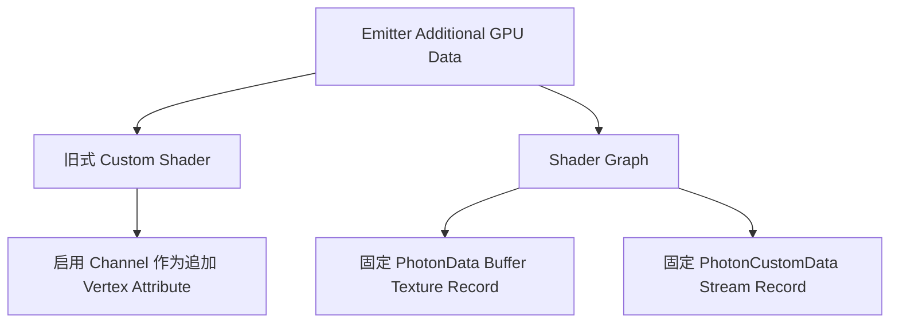

# Vertex Format 与 GPU Instancing

<VersionBadge version="2.2.0" label="GPU Instancing" icon="tag" />

*Instance 测试项目会实际走 Particle Instance Format，并同时展示 Scene、Inspector、Resources 与 Timeline。*

Photon 会合并几何和材质状态相同的对象，一次绘制多个 Instance。基础 Mesh Vertex 描述 Quad、Model 或 Trail Segment；逐 Instance Record 提供 Transform、Color、UV、Light 和可选数据。

## 渲染 Variant

| Define | 几何 | 基础 Instance 内容 |
| --- | --- | --- |
| `PARTICLE_INSTANCE` | Billboard/Tile Quad | position、rotation、size、color、UV/light |
| `PARTICLE_MODEL_INSTANCE` | Model Mesh | transform、color、UV/light 与 Model Attribute |
| `TRAIL_INSTANCE` | Flat/Tube Trail Segment | 端点、逐点 width/color/UV |
| `BEAM_INSTANCE` | Ray/Beam Segment | start/end、width/color/UV |
| `ARATRAIL_INSTANCE` | 物理 Trail Segment | 相邻点数据与插值 |

非 Instanced CPU 路径仍会提供 Particle Data，但 Additional/Custom Data 的 Graph Accessor 返回 0。Graph 依赖这些流时必须启用 GPU Instancing。

## 两种数据布局

旧式 Attribute Layout 只包含 Inspector 启用的 Channel，并按 Registry 顺序排列。启用一个新 Channel 可能移动后续 Attribute Location，手写 Shader 必须和发射器配置完全一致。

Shader Graph 按发射器类型使用固定 `vec4` Slot Layout，并通过 `gl_InstanceID` 索引。Compiler 会记录 Graph 读取的 Channel 并上传有效 Mask，同一个编译结果可服务 Inspector Toggle 不同的发射器。

## Batching 限制

Geometry、Material Program、Texture/Sampler State、Render Layer 或所需 Layout 不同时都会拆 Batch。多材质 Model 需要多个 Pass。大量 Custom Data 和透明层即使粒子数不多，也会增加上传与排序成本。

不要默认 Instancing 一定更快，应结合 Profiler 和 Render Statistics。只有几个粒子时初始化成本可能占主导；几百个相同 Quad/Model 时通常收益明显。

## Shader 编写检查

- Shader Graph 使用 Photon Accessor；Custom Shader Material 的传统数据路径必须声明与 Emitter 开关匹配的 Attribute Location。
- `PhotonData` 通过 `gl_InstanceID` 而不是 Vertex ID 索引。
- 不支持 Channel 时返回 0，Shader 要有合理 Fallback。
- 透明排序/Layer 保持一致，发射器才容易合批。
- 分别测试 Tile、Model、Trail 与 Beam，它们的基础输入不可互换。

Custom Stream 的 Location 公式与完整代码见 [Additional GPU Data](./additional-gpu-data.md)。
