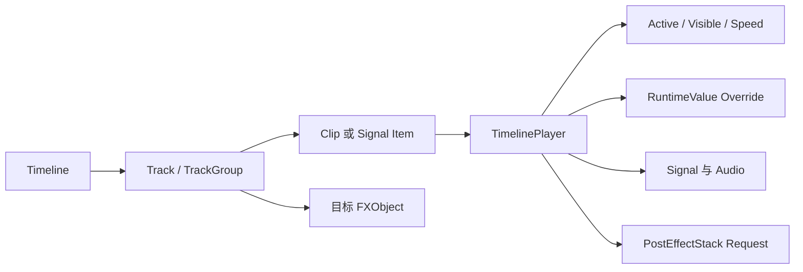

# Timeline

<VersionBadge version="2.2.0" label="自" icon="tag" />

Timeline 使用 Track 和 Clip 编排 FX。它可以控制对象启用状态、使用确定 Seed 重启对象、动画 Transform 与 Emitter Runtime Property、改变模拟速度、发送 Signal、播放声音并请求后处理。

<figure>

<figcaption>最大化编辑器把 Timeline 与动画 Scene、目标 Inspector、Resources 和 Hierarchy 同时展示。</figcaption>
</figure>

## 内置 Track 类型

| Track | 控制内容 |
| --- | --- |
| Activator | 一个目标对象在 Clip 范围内是否 Active。 |
| Control | 每个 Clip 重启并播放哪个对象/子树。 |
| Animation | Transform 或已注册的 Emitter Runtime Property。 |
| Speed | 层级 Simulation `timeScale`。 |
| Signal | 带 `CompoundTag` 数据的命名事件。 |
| Audio | Sound、Volume/Pitch Envelope 和可选目标位置。 |
| Post Process | 每帧加权后处理请求与参数 Override。 |
| Group | 组织 Track，并提供层级/Mute 结构。 |

## Runtime Clock

始终启用的 FX Root 会在每个 Particle Engine tick 推进一次 `TimelinePlayer`。Per-frame Pass 使用小数时间平滑采样 Transform Animation，并提交生效的 Post Process Clip。Simulation 保持 tick 确定性，渲染运动则能插值。

## 空 Timeline

旧效果和简单效果可以没有 Timeline 数据。空 Timeline 不增加播放工作，FX 会像以前一样根据 Emitter 状态结束。

## 继续阅读

- [编辑器与播放](./editor-and-playback.md)
- [Track 与 Clip](./tracks-and-clips.md)
- [Animation 与 Record Mode](./animation-and-recording.md)
- [Activator、Control 与 Speed](./activator-control-and-speed.md)
- [Signal、Audio、Group 与 Post Process](./signals-audio-groups-and-post.md)
